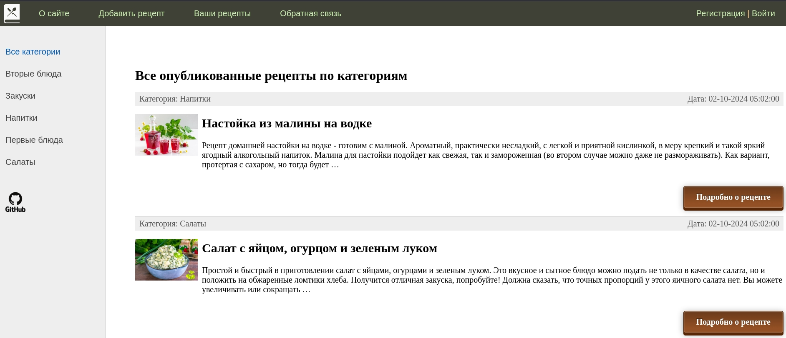

# BlogRecipes 🍽️ - персональный продуктовый блог

<br/>

BlogRecipes - это онлайн-сервис для гурманов и любителей кулинарии. Проект предоставляет возможность создавать и
публиковать любимые рецепты, а также находить рецепты других авторов. Пользователи могут
составлять список избранных блюд и указывать ингридиенты для необходимых приготовления выбранных рецептов.



### Стек проекта


[](https://github.com/arletino/django_blog/blob/main/LICENSE)


### Каталоги

📁 **blog:** файлы, необходимые для сборки и запуска бэкенд-приложения.


### Установка и Запуск Backend API на хосте

Для того чтобы установить и запустить бэкенд API локально, выполните следующие шаги:

1. Клонируйте проект:

```shell
git clone https://github.com/arletino/django_blog.git
```

2. Создайте файл .env с тестовыми переменными в корне проекта:

```dotenv
SECRET_KEY=django-insecure-_u(dlspjs)6n28(sfn_6efk!qdn-gt5k5=d#=5sr7=2-z=!)%r
DEBUG=True
ALLOWED_HOSTS=
CSRF_TRUSTED_ORIGINS=
```

3. Установите виртуальное окружение и активируйте его:
  
    * Git Bash (Windows), Linux, Mac:
   ```shell
   python -m venv venv
   source venv/Scripts/activate
   ```
4. Перейдите в папку с проектом и установите зависимости:

```shell
cd .\blog_recipes\
pip install .
```

5. Выполните миграции и запустите сервер:

```shell
python3 manage.py migrate
python3 manage.py runserver
```

По умолчанию, проект будет доступен по адресу: http://127.0.0.1:8000/, а также будет испозоваться sqlite для упрощения
работы с проектом.

6. Дополнительно, вы можете добавить тестовые данные из скрипта python:

```shell
python3 manage.py create_db_data
```