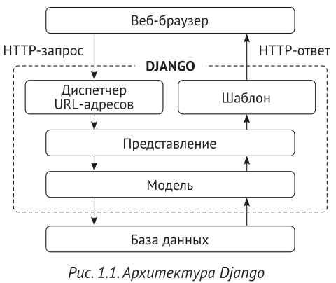

Архитектура Django

Вот как Django оперирует HTTP-запросами и генерирует ответы:
1. Веб-браузер запрашивает страницу по ее URL-адресу, и веб-сервер пе-
редает HTTP-запрос веб-фреймворку Django.
2. Django просматривает свои сконфигурированные шаблоны URL-адресов
и останавливается на первом, который совпадает с запрошенным URL-
адресом.
3. Django исполняет представление, соответствующее совпавшему шабло-
ну URL-адреса.
4. Представление потенциально использует модели данных, чтобы из-
влекать информацию из базы данных.
5. Модели данных обеспечивают определение данных и их поведение.
Они используются для запроса к базе данных.
6. Представление прорисовывает1 шаблон (обычно с использованием
HTML), чтобы отображать данные на странице, и возвращает их вместе
с HTTP-ответом.
  
Зачем использовать представления на основе классов  
Представления на основе классов обладают некоторыми преимуществами по сравнению с представлениями на основе функций, которые удобны для конкретных случаев использования. Представления на основе классов по-зволяют: 
• организовывать исходный код, относящийся к HTTP-методам, таким как GET, POST или PUT, в отдельные методы, не используя ветвление по условию;  
• использовать множественное наследование, чтобы создавать реиспользуемые классы-представления (также именуемые примесями, примесными классами или миксинами).  
